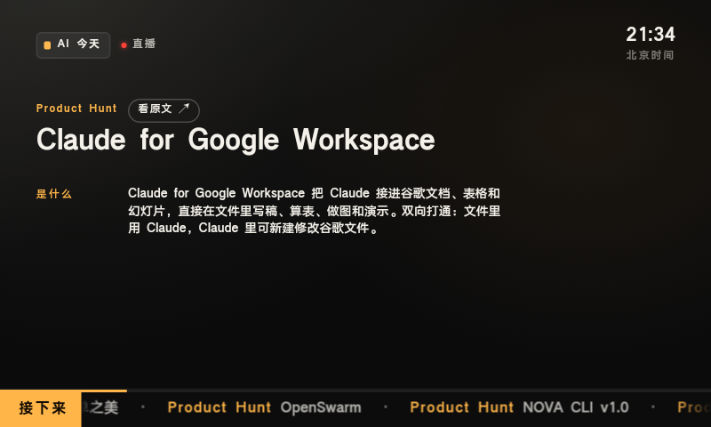

# AI 今天 · AITV

**中文** | [English](#english)

一个持续更新的 AI 新闻台：打开收听 AI 新闻、产品和开源项目，跟随讲解字幕，随时点开原文。

A live AI news channel with synchronized narration, captions, and links to original sources.

[立即收听](https://aitv.qiaomu.ai/) · [技术文档](docs/ARCHITECTURE.md) · [MIT 许可证](LICENSE) · [贡献指南](CONTRIBUTING.md)

[](https://github.com/joeseesun/aitv/actions/workflows/check.yml)


## 这是什么

AITV 把 AI 资讯整理成连续播放的节目。浏览器根据音频与时间轴实时呈现画面，无需预先渲染视频。适合想边工作边了解 AI 动态，或希望自建资讯频道的人。

| 能力 | 使用体验 |
|---|---|
| 多来源资讯 | Hacker News、GitHub Trending、Product Hunt、AIHOT，以及 OpenAI、DeepMind、TechCrunch AI RSS |
| 同步直播 | 按服务器时钟定位，在节目边界一起切换 |
| 讲解与字幕 | 「是什么 / 跟你有关 / AI 点评」，可查看原文 |
| 可暂停、可追直播 | 点击画面或按空格暂停/继续，按 L 回到直播 |
| 手机上阅读 | 竖屏正文可滚动；保留电视画面，也提供 `?ui=v4` 全屏版本 |
| 自动更新 | 已配置的部署通过定时任务抓取、补料、写稿、合成与发布，支持额度限制和恢复 |

<details>
<summary>查看手机画面</summary>


</details>

## 快速开始

**直接使用：** 打开 [aitv.qiaomu.ai](https://aitv.qiaomu.ai/)，点击「开机」收听。无需账号。

**本地开发：** 需要 Node.js 22+ 与 Wrangler 4。

```bash
git clone https://github.com/joeseesun/aitv.git
cd aitv
npm install -g wrangler
npm install
npm test
npm run seed
npm run dev
```

打开 `http://localhost:8787`。`npm run seed` 只把仓库样例写入本地 KV，方便预览画面；不调用模型或语音服务。样例音频和配图存储在独立 R2 中，仓库不包含媒体文件，因此本地预览没有声音和配图。完整收听可使用在线演示；自建实例需要准备自己的媒体与节目单。

## 老设备兼容版

系统 WebView 停在旧版本的安卓设备（例如 Android 8 的电视盒子、触屏音箱，内核 Chrome 61）打不开主站：脚本语法和 CSS 太新，页面停在「正在连接直播…」。`npm run build` 会额外生成兼容版 `/legacy/`：esbuild 把播放器降级到 chrome61，补齐缺的 API，用 JS 计算原来靠 container query 单位缩放的画面，画面铺满屏幕、去掉页脚，小屏上底栏字号有下限。

本地预览：`npm run legacy:serve`（`/api`、`/audio`、`/img` 转发到线上），设备上 `adb reverse tcp:8788 tcp:8788` 后打开 `http://localhost:8788/legacy/`。



## 自建部署

1. 将 `wrangler.example.toml` 复制为 `wrangler.toml`，使用自己的 Worker 名称、KV 命名空间和 R2 桶。仓库原配置指向维护者的演示服务，请勿直接复用。
2. 设置 `AITV_BASE` 为自己的线上地址、`AITV_BUCKET` 为与配置一致的 R2 桶名（本地媒体/发布脚本使用），并用 `wrangler login` 登录自己的 Cloudflare 账户。完整生成流水线还需 DeepSeek 和豆包语音服务凭据，通过 `wrangler secret put DEEPSEEK_API_KEY` 与 `wrangler secret put DOUBAO_TTS_ACCESS_TOKEN` 设置。
3. 示例配置默认关闭自动发布、合成额度和 cron。准备好预算、音频与节目单后，再显式开启对应设置。模型、语音与 Cloudflare 服务可能产生费用。
4. 将配置提交到你自己的仓库。`npm run deploy` 只允许从干净的 `main` 且与 `origin/main` 一致的目录部署。

节目单生成、媒体存储、版本切换与回滚见 [技术文档](docs/ARCHITECTURE.md)。可选本地 Python 合成脚本需要 Python、`websockets` 和 FFmpeg；Worker 流水线不需要 Python。

## 架构

```text
资讯源 → 原文补料 → AI 写稿 → 数字/语气/安全校验 → 语音合成
                                                     ↓
浏览器 ← Worker API ← KV 节目单 / R2 音频与配图 ← 定时流水线
```

- `public/`：播放、校时、加载状态与网站信息。
- `screen/`：可独立迭代的画面与字幕。
- `src/`：Worker、抓取、内容校验、生成与时间线。
- `scripts/`：本地预览、媒体生成、部署与发布工具。
- `test/`：离线回归测试；`releases/`：节目单样例。

## 验证与边界

- 已运行 178 项测试，并核对线上部署提交；浏览器播放、同步、暂停、回到直播和手机布局已检查。
- 同一份样例的播放器 JSON 从约 174 KB 降到 39 KB。模拟慢网启动从 2.23 秒降到 1.35 秒，是单次本地对照结果；实际速度取决于网络与服务响应。
- 新闻摘要与点评由 AI 生成，事实核对应以原文为准。数字校验约束引用来源数据，不代表独立验证来源事实。
- 资讯来源可用性、模型账户和合成服务不是本仓库提供的免费服务。
- Service Worker 只缓存离线说明，直播节目单、音频和脚本始终请求网络。真实 iOS/Android 安装体验尚未验证。
- 演示站有 Cloudflare 的访问统计脚本；本轮未接入 Umami。自建时可按需要调整统计与品牌入口。

## 贡献与许可证

欢迎通过 [Issues](https://github.com/joeseesun/aitv/issues) 提交问题或通过 PR 改进，提交前阅读 [CONTRIBUTING.md](CONTRIBUTING.md)。安全问题请按 [SECURITY.md](SECURITY.md) 私下报告。

本项目代码采用 [MIT License](LICENSE)，允许使用、修改、分发与商业使用，保留版权及许可证声明。外部资讯、第三方配图、音频服务和第三方测试样例的权利仍归各自权利人，MIT 不重新授权这些内容。

由 [向阳乔木 / joeseesun](https://github.com/joeseesun) 维护。 [个人网站](https://qiaomu.ai) · [博客](https://blog.qiaomu.ai) · [乔木推荐](https://tuijian.qiaomu.ai/) · [X @vista8](https://x.com/vista8)

微信公众号：向阳乔木推荐看。

---

<a id="english"></a>

# English

AITV is a continuously updated AI news channel. The browser renders a TV-style screen from audio and a shared timeline, with captions and original-source links. Try the [live demo](https://aitv.qiaomu.ai/) without an account.

Sources include Hacker News, GitHub Trending, Product Hunt, AIHOT, OpenAI News, Google DeepMind and TechCrunch AI. Click the screen or press Space to pause/resume; press L to return to live. The fullscreen screen is available with `?ui=v4`.

## Local development

Requirements: Node.js 22+ and Wrangler 4.

```bash
git clone https://github.com/joeseesun/aitv.git
cd aitv
npm install -g wrangler
npm install
npm test
npm run seed
npm run dev
```

Visit `http://localhost:8787`. The seed command writes only to local KV and starts no paid generation. Repository fixtures support visual preview; audio and images are stored separately in R2 and are not included. Use the live demo to listen, or provide your own media for self-hosting.

## Older devices

Devices whose system WebView is stuck on an old Chromium (e.g. Android 8 TV boxes and smart displays on Chrome 61) cannot run the main site. `npm run build` also emits a compatibility build at `/legacy/`: the player down-levelled to chrome61 with esbuild, polyfills, a JS replacement for container-query units, and a full-screen layout. Preview it locally with `npm run legacy:serve`.

## Self-hosting

Copy `wrangler.example.toml` to `wrangler.toml` and configure your own Worker, KV and R2 resources. Do not deploy with the maintainer's demo configuration. Set `AITV_BASE` to your own deployment URL and `AITV_BUCKET` to the R2 bucket configured above for media/release scripts. Sign in using `wrangler login`; configure DeepSeek and Doubao credentials using Wrangler secrets if you want automated generation.

The example disables automatic publication, generation budgets and cron. Enable them only after configuring your own content, media and budgets. Provider and hosting charges may apply. Deployment requires a clean `main` synchronized with your own `origin/main`. See the [architecture and operations guide](docs/ARCHITECTURE.md) for release and rollback details. Optional Python synthesis scripts require Python, `websockets` and FFmpeg; the Worker pipeline does not require Python.

178 tests passed during the latest verification. Desktop/mobile browser rendering and playback synchronization were checked; physical mobile-device installation remains unverified. AI summaries and commentary may contain errors; consult the original sources. Offline support is an explanatory fallback, not downloaded broadcasts.

Contributions are welcome; see [CONTRIBUTING.md](CONTRIBUTING.md) and [SECURITY.md](SECURITY.md). Original project code is licensed under [MIT](LICENSE). Third-party news, media, provider services and test fixtures retain their respective rights.
